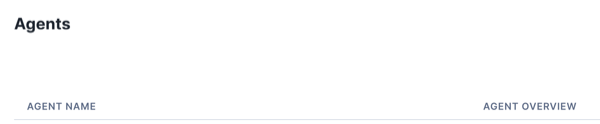

# Creating an Agent for Snowflake Intelligence

## Prepare your account for Snowflake Intelligence Agents

The main thing you need to do to prepare your account for Snowflake Intelligence is ensure you have a `snowflake_intelligence.agents` schema in your account. This is the schema that will be used to organize the agents you create for Snowflake Intelligence. 

To create the schema, you can use the following SQL command:

```sql
CREATE DATABASE IF NOT EXISTS snowflake_intelligence;
CREATE SCHEMA IF NOT EXISTS snowflake_intelligence.agents;
-- Allow anyone to see the agents in this schema
GRANT USAGE ON DATABASE snowflake_intelligence TO ROLE PUBLIC;
GRANT USAGE ON SCHEMA snowflake_intelligence.agents TO ROLE PUBLIC;
-- You can also add additional roles to be able to create agents for Snowflake Intelligence
-- GRANT CREATE ON SCHEMA snowflake_intelligence.agents TO ROLE <your_role>;
```

## Check to make sure you're on the latest version of Snowflake Intelligence

In Snowsight, under AI+ML select the *Agents* tab.

If you see a schema selector in the agent UI like the below, you are on the latest version and can continue below.  
  

If you do not see a schema selector, you are on an older version of the agent object.  
  

**You either need to work with your account team to enable the new version or follow the [previous setup instructions](https://docs.google.com/document/d/1J1Mu-bo-F8EITmGET4-KaOUlqkIdyYG_Xmkt9I9kdXU/edit?tab=t.31gmj4wpslj7)**.

## Create the Agent

In Snowsight, under AI+ML select the *Agents* tab.

Click the *Create Agent* button in the top right corner.

The experience will walk through creating your first agent. Once created you can edit the configration (in the top right corner) to add additional tools (Semantic Views, Cortex Search, Custom Tools). I often start with a basic agent called "General Knowledge" which has no tools and can just be used to answer general questions on the underlying model (Claude or GPT).

Be aware of the *Access* tab in the agent configuration where you can define which roles can use and see this agent.

## Talking to the agent

You can use the playground in the admin experience to test an agent configuration after saving changes. Additionally, once saved and in the `snowflake_intelligence.agents` schema, you can view and interact with the agent through Snowflake Intelligence (either accessing Snowflake Intelligence through Snowsight under AI+ML or via https://ai.snowflake.com).

### The importance of default_roles and default_warehouse
When users navigate to Snowflake Intelligence, by default we use the users `DEFAULT_ROLE` for their permissions, and the `DEFAULT_WAREHOUSE` to execute any queries if one is not specified by the tool. So be sure any users navigating to Snowflake Intelligence have a `DEFAULT_ROLE` set that has access to the following:
- `USAGE` on the `snowflake_intelligence` database
- `USAGE` on the `snowflake_intelligence.agents` schema
- `SELECT` on any semantic views used by the agent
- `SELECT` on any tables defined in the semantic views
- `USAGE` on any cortex search services used by the agent

In the admin experience you can see the *Verify Access* button which should check the above for any role you have given access to an agent.